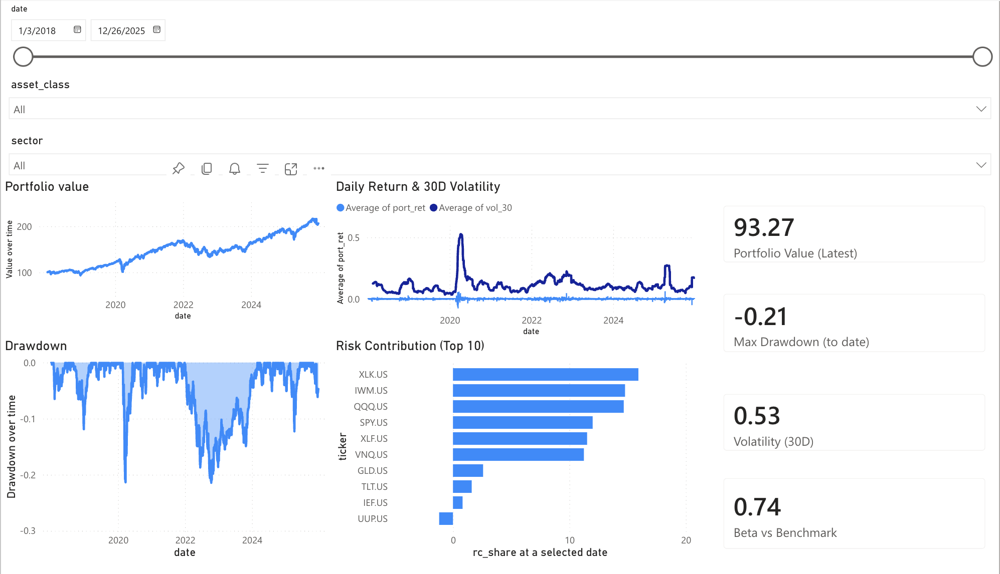
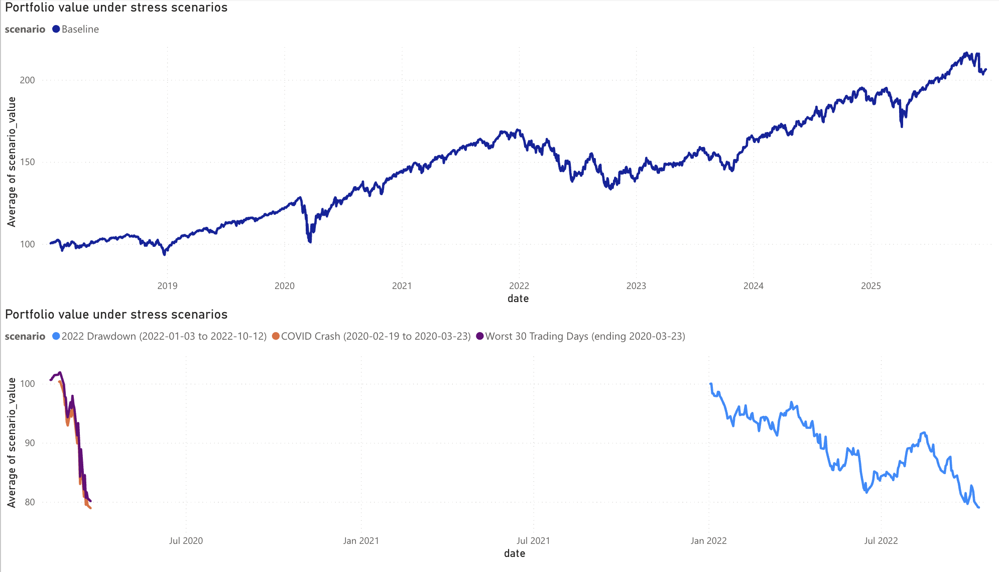

# Portfolio Risk Dashboard (Python → Power BI Web)

A reproducible, end-to-end mini-project that builds a **portfolio risk dataset in Python** (prices → positions → portfolio returns → risk metrics → stress scenarios) and publishes it as a **Power BI (web) dashboard** using an Excel upload (OneDrive/SharePoint).

This repo is designed to demonstrate “employer-relevant” skills:
- clean Python pipeline + file structure
- metrics common in risk analysis (drawdown, rolling vol, beta, VaR/CVaR)
- Power BI modeling + visuals (slicers, relationships, KPI cards, line + bar charts)
- GitHub-ready documentation + artifacts

---

## What’s inside

### Outputs (generated by the pipeline)
The pipeline produces these tables (CSV) used by Power BI:

- `portfolio_daily.csv` — daily portfolio value + portfolio return
- `risk_daily.csv` — drawdown, rolling vol (30/60/252), beta, VaR/CVaR
- `risk_contrib.csv` — (example) risk contribution shares by ticker
- `stress_daily.csv` — scenario paths (baseline + historical stress windows)
- `dim_date.csv` — date dimension for slicers
- `dim_asset.csv` — asset dimension (ticker, asset class, sector)

Power BI is loaded from an Excel workbook generated by Python:
- `data/processed/powerbi_upload.xlsx`

---

## Dashboard (Power BI Web)

Power BI files created in the web service cannot always be committed as `.pbix` (org settings often block downloads).
Instead, this repo stores dashboard artifacts (screenshots/PDF export) in:

- `docs/powerbi/`

Recommended report pages:
- **Overview**: Portfolio Value, Drawdown, Daily Return & 30D Vol, KPI cards, Risk Contribution (Top 10)
- **Stress Tests**: Baseline vs scenarios + scenario-only view

---


## Quickstart

### 1) Create a virtual environment and install dependencies
```
python -m venv .venv
source .venv/bin/activate
python -m pip install -r requirements.txt
```
### 2) Configure the universe (tickers)

Edit:
**data/sample/universe.csv**
Example format:

ticker,asset_class,sector
SPY.US,Equity,US Equity
TLT.US,Bonds,US Treasury
GLD.US,Commodity,Gold

### 3) Run the pipeline (CSV outputs for Power BI)
```
python src/01_fetch_prices.py --start 2018-01-01 --end 2025-12-26

python src/02_make_positions.py

python src/03_build_portfolio.py

python src/04_compute_risk.py

python src/05_stress_tests.py
```
**Expected outputs (in data/processed/):**
```
prices.parquet

positions.csv

portfolio_daily.csv

returns_asset.csv

risk_daily.csv

risk_contrib.csv

stress_daily.csv

dim_date.csv

dim_asset.csv
```
### 4) Build the Power BI upload workbook (ensures real Excel date types)

python src/07_export_powerbi_excel.py

This creates:
**data/processed/powerbi_upload.xlsx**

## Power BI Web (exact import path)

**Upload workbook to OneDrive / SharePoint**

Upload:
***data/processed/powerbi_upload.xlsx***

**Import in Power BI (web)**
***Power BI →*** My workspace

***Import →*** OneDrive/SharePoint

***Select*** powerbi_upload.xlsx

***Select*** the 6 tables/sheets and Transform data

***Confirm:***

   first row is headers

   date columns are type Date

   numeric columns are type Decimal number

***Close & Apply***

### Relationships to create (Model view)

Create these relationships (1:* , single direction, active):
```
dim_date[date] → portfolio_daily[date]

dim_date[date] → risk_daily[date]

dim_date[date] → risk_contrib[date]

dim_date[date] → stress_daily[date]

dim_asset[ticker] → risk_contrib[ticker]
```
### Visuals (recommended)
***Overview page***

`Slicer:` dim_date[date] (Between)

`Line:` portfolio_daily[portfolio_value] by dim_date[date]

`Line/Area:` risk_daily[drawdown] by dim_date[date]

`Combo:` daily return vs 30D vol (portfolio_return columns, vol_30 line)

`Cards:` latest value / max drawdown / vol / beta / VaR

`Bar:` risk contribution (Top 10) using risk_contrib[rc_share] by ticker

***Stress Tests page***

`Baseline chart (scenario = Baseline)`

`Scenario chart (exclude Baseline) with scenario slicer`

### Notes on the metrics
***Rolling vol (30/60/252)*** is null for early dates because the window needs enough history.

***VaR/CVaR*** uses a rolling historical window (e.g., 252 trading days).

***Beta*** is computed relative to a benchmark series (defined in the risk script).

### Troubleshooting
**Power BI slicer doesn’t filter charts**
Ensure charts use dim_date[date] on X-axis (not Year-only fields).

Verify relationships are active and date columns are type Date.

Check “Edit interactions” to ensure slicer filters each visual.

**Excel dates imported as text**
Always create the workbook via:
```
python src/07_export_powerbi_excel.py
```
This forces real Excel date types.

### Figures (Power BI)





### Author
Arina Veprikova

